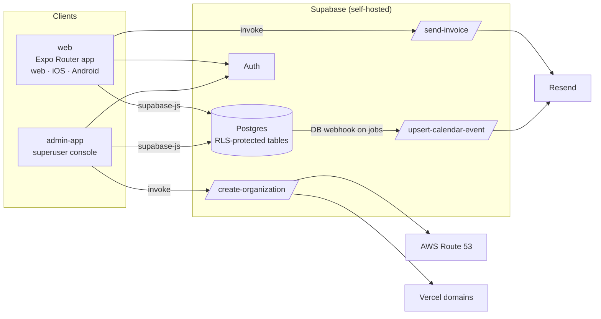

<p align="center">
  
</p>

<h1 align="center">HandyTally</h1>

<p align="center">
  Job, client, inventory and invoice management for trades and field-service businesses.
</p>

<p align="center">
  <a href="https://github.com/HandyTally-Org/HandyTally/actions/workflows/ci.yml"></a>
  
  
  
  
</p>

---

## Overview

HandyTally is a multi-tenant back-office for small contracting businesses. An organization signs up, gets its own subdomain, and runs its day-to-day from one place: clients, jobs, scheduling, labor, materials inventory, and estimates → work orders → invoices, including emailing the finished invoice to the client.

The product is delivered as an **Expo / React Native** codebase that targets the web first (deployed on AWS Amplify) and can also ship to iOS and Android. **Supabase** (self-hosted) provides Postgres, auth, row-level security, storage and Deno edge functions.

## Features

| Area | What you get |
| --- | --- |
| **Dashboard** | Client, active-job, pending-invoice and low-stock counts, sales-over-time chart, recent activity feed |
| **Clients** | CRUD, tagging from the list view, per-client job and invoice history |
| **Jobs** | Status tracking, costs, attachments, client linking, Excel import/export (jobs, job costs, attachments) |
| **Schedule** | Weekly / monthly calendar of jobs; each job emails a calendar invitation to the client and the user who created it |
| **Invoices** | Joist-style document editor with line items, item notes and photos, percentage or fixed fees, tax; document lifecycle `estimate → work_order → sent → partial_paid / paid / overdue`; print, PDF, and email-to-client via Resend |
| **Inventory & Services** | Materials with stock levels and low-stock warnings; service catalog with rates |
| **Labor** | Labor entries against jobs |
| **Admin** | Company profile and logo, user management backed directly by `auth.users` |
| **Multi-tenancy** | Organizations with per-org subdomains, memberships and roles (`user`, `admin`, `superuser`) |
| **Superuser console** | Separate `admin-app` for creating organizations and managing users across tenants |

## Architecture



- **Data access** goes straight from the client to Postgres through `supabase-js`; authorization is enforced by row-level security and `SECURITY DEFINER` functions, not by an application server.
- **Edge functions** exist only where a secret or a third-party API is involved (email, calendar, DNS).
- **Invoice HTML** is rendered once in the client (`web/utils/invoiceHtml.ts`) and reused for on-screen preview, print, and the emailed document, so what the sender sees is what the client receives.

## Repository layout

```
.
├── web/                    Main HandyTally app (Expo Router, React Native Paper)
│   ├── app/                File-based routes: (auth) login/signup, (app) dashboard, clients, jobs,
│   │                       invoices, inventory, labor, schedule, admin/*
│   ├── components/         Forms, list items, invoice document, sidebar, calendars
│   ├── contexts/           AuthContext (session + role gate)
│   ├── lib/                supabase client, api helpers
│   ├── utils/              date/format helpers, invoiceHtml builder
│   ├── styles/             global + print CSS
│   └── amplify.yml         AWS Amplify build spec (npm ci → expo export → dist/)
├── admin-app/              Superuser console (Expo, React Navigation)
├── supabase/
│   ├── config.toml         Local Supabase CLI config
│   ├── migrations/         Schema history (apply with `supabase db push`)
│   └── functions/          Deno edge functions: send-invoice, upsert-calendar-event, create-organization
├── database/               Hand-applied SQL: auth admin RPCs (auth_functions.sql) and reference schema
├── Docs/                   Product context and phased task plan
└── .github/                CI, issue and PR templates
```

## Tech stack

| Layer | Choice |
| --- | --- |
| UI | React Native 0.76, React 18, Expo SDK 52, Expo Router 4, React Native Paper 5 |
| Web build | Metro static export → AWS Amplify |
| Data | Supabase (Postgres 15, Auth, Storage), `@supabase/supabase-js` |
| Serverless | Supabase Edge Functions (Deno) |
| Email | Resend |
| Calendar invites | iCalendar (`.ics`) attachments sent through Resend |
| Spreadsheets | SheetJS (`xlsx`) |
| Charts / calendar UI | react-native-chart-kit, react-big-calendar, FullCalendar |
| Language | TypeScript |

## Getting started

### Prerequisites

- Node.js 20+ and npm
- [Supabase CLI](https://supabase.com/docs/guides/cli) (for migrations and local functions)
- Access to a Supabase project (self-hosted or hosted) with the migrations applied

### 1. Web app

```bash
cd web
cp .env.example .env
npm install
npx expo start --web
```

`npx expo start` without `--web` opens the Expo dev tools for iOS / Android.

### 2. Admin app

```bash
cd admin-app
cp .env.example .env
npm install
npx expo start --web
```

### 3. Database

Apply the migrations to your Supabase project:

```bash
supabase link --project-ref <ref>
supabase db push
```

Then run [`database/auth_functions.sql`](database/auth_functions.sql) in the SQL editor. It creates the `SECURITY DEFINER` RPCs (`get_all_users`, `admin_update_user_*`, `admin_delete_user`, `admin_confirm_user`) that the Admin → Users page depends on. See [`database/README.md`](database/README.md).

### 4. Edge functions

```bash
supabase functions deploy send-invoice
supabase functions deploy upsert-calendar-event
supabase functions deploy create-organization
```

Each function reads its secrets from the project's function secrets — see [Configuration](#configuration). `upsert-calendar-event` is invoked by a **database webhook on the `jobs` table**, which must be configured in the Supabase dashboard after deploy.

## Configuration

### Client apps (`EXPO_PUBLIC_*`)

| Variable | Used by | Purpose |
| --- | --- | --- |
| `EXPO_PUBLIC_SUPABASE_URL` | web, admin-app | Supabase API URL |
| `EXPO_PUBLIC_SUPABASE_ANON_KEY` | web, admin-app | Supabase anon key |
| `EXPO_PUBLIC_BASE_DOMAIN` | web | Base domain used to build per-organization subdomains |
| `EXPO_PUBLIC_VERCEL_TEAM_ID` | web | Vercel team used for subdomain provisioning |

### Edge function secrets

| Function | Secret | Purpose |
| --- | --- | --- |
| `send-invoice` | `RESEND_API_KEY` | Resend API key |
| | `INVOICE_FROM_ADDRESS` | Verified sender, e.g. `HandyTally <invoices@handytally.com>` |
| | `INVOICE_REPLY_TO` | Optional reply-to address |
| `upsert-calendar-event` | `RESEND_API_KEY`, `INVOICE_FROM_ADDRESS`, `INVOICE_REPLY_TO` | Same Resend sender as `send-invoice`; the from address is the invite's organiser |
| | `CALENDAR_FROM_ADDRESS` | Optional sender override for invites only |
| | `SUPABASE_URL`, `SUPABASE_ANON_KEY` | Provided automatically by Supabase |
| `create-organization` | `SUPABASE_URL`, `SUPABASE_SERVICE_ROLE_KEY` | Service-role client for cross-tenant writes |
| | `BASE_DOMAIN` | Root domain for tenant subdomains |
| | `AWS_ACCESS_KEY_ID`, `AWS_SECRET_ACCESS_KEY`, `AWS_REGION`, `AWS_HOSTED_ZONE_ID` | Route 53 record creation |
| | `VERCEL_TOKEN`, `VERCEL_TEAM_ID` | Attach the subdomain to the Vercel project |
| | `GITHUB_TOKEN`, `GITHUB_REPO` | Optional repository dispatch after provisioning |

Set them with `supabase secrets set KEY=value`. Never commit them; `.env*` is git-ignored.

## Data model

Core tables (see `supabase/migrations/` for the authoritative definitions):

| Table | Notes |
| --- | --- |
| `organizations`, `organization_memberships` | Tenant and membership with `user_role` (`user` / `admin` / `superuser`) |
| `user_profiles`, `profiles`, `user_roles` | Per-user profile, role and active flag |
| `company`, `company_attachments` | Company details and logo (stored inline as base64) |
| `clients` | Contact details, tags |
| `jobs`, `job_costs`, `jobs_attachments`, `job_calendar_events` | Job lifecycle, costs, files and the mirrored calendar event |
| `invoices`, `invoice_items` | Documents and line items. `status` carries both document type and payment state; `sent_at` independently records when it was last emailed. Items carry `notes` and `photos` (JSON, base64). Fees are `fee_type` (`fixed` / `percent`) + `fee_value` → `fee_amount`, applied before tax |
| `materials`, `services` | Inventory and service catalog |
| `email_integrations` | Per-org outbound email settings |
| `audit_log` | Change history |

### Roles

| Role | Can |
| --- | --- |
| `user` | Work inside their organization |
| `admin` | Above, plus company settings and user management for their organization |
| `superuser` | Above, plus create organizations and manage users across tenants (admin-app) |

## Deployment

- **Web** — AWS Amplify builds from [`web/amplify.yml`](web/amplify.yml): `npm ci` → `npx expo export` → serve `dist/`. Set the `EXPO_PUBLIC_*` variables in the Amplify environment.
- **Database & functions** — `supabase db push` and `supabase functions deploy` against the linked project. Function secrets are managed with `supabase secrets set`.
- **Tenant subdomains** — created at runtime by `create-organization` (Route 53 record + Vercel domain), not by the deploy pipeline.

## Development workflow

- Work is tracked as `HT-<n>` issues. Branch as `feat/ht-<n>-short-description` or `fix/ht-<n>-short-description` and prefix commit subjects with the ticket (`HT-4: Send an invoice to the client by email`).
- Open a pull request against `master`; CI builds the web app. See [CONTRIBUTING.md](CONTRIBUTING.md).
- Schema changes go in a new file under `supabase/migrations/` with a comment explaining *why*, not only what.

## Roadmap

The phased plan lives in [`Docs/tasks.md`](Docs/tasks.md). Highlights still ahead:

- PDF attachment on emailed invoices (the `send-invoice` payload already reserves `attachments`)
- Reporting: revenue, inventory and client-activity reports
- Notifications for low stock, overdue invoices and job deadlines
- Recurring invoices and accounting integrations

## Further reading

- [`Docs/architecture.md`](Docs/architecture.md) — detailed technical breakdown: auth and RLS, multi-tenancy, data model, edge functions, key flows
- [`Docs/dev-issues.md`](Docs/dev-issues.md) — catalog of known technical issues with evidence, fixes and a suggested order of work
- [`Docs/context.md`](Docs/context.md) — original product brief (historical)
- [`database/README.md`](database/README.md) — auth admin RPC setup
- [`web/app/(app)/admin/README.md`](<web/app/(app)/admin/README.md>) — how user management reads `auth.users`
- [`supabase/README.md`](supabase/README.md) — edge functions and secrets

## Security

Please report vulnerabilities privately as described in [SECURITY.md](SECURITY.md).

## License

Copyright © HandyTally. All rights reserved. This is proprietary software; contact the organization for licensing terms.
